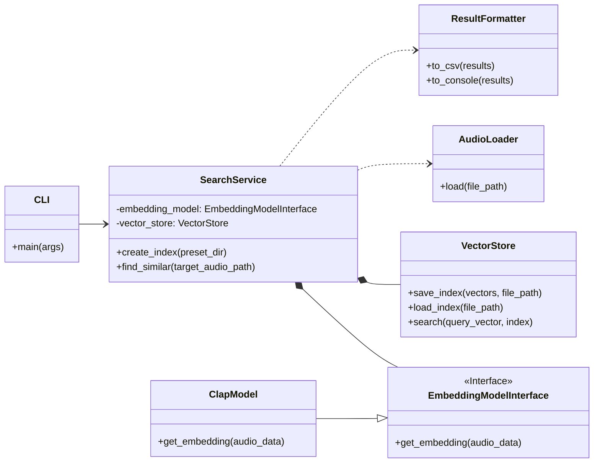
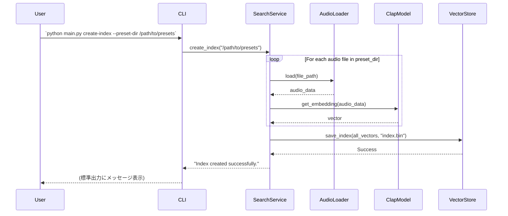
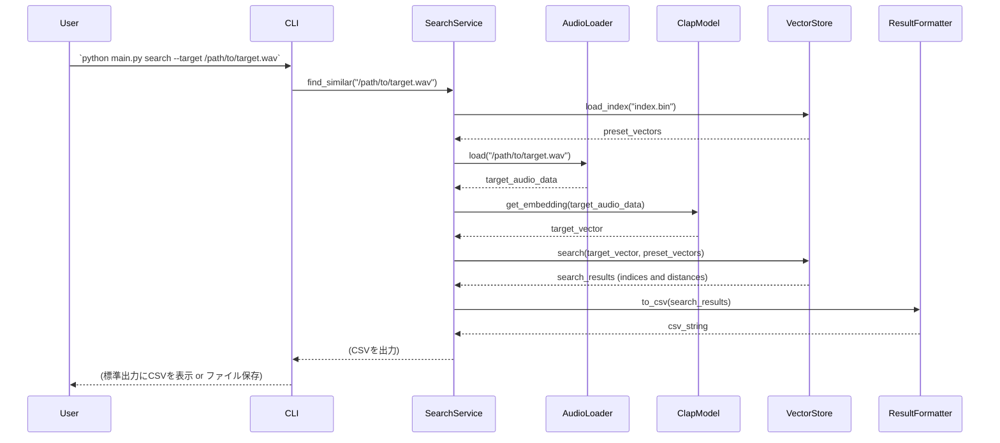

---
tags:
  - dev
---
### ソフトウェアアーキテクチャ設計書

#### 1. 概要

本ドキュメントは、[要件定義書](# "null")に基づき、類似音色プリセット検索アプリケーションのソフトウェアアーキテクチャを定義するものです。初期開発フェーズにおけるシステムの構造、コンポーネント、処理フロー、および設計上の決定事項について記述します。

#### 2. アーキテクチャ目標

要件定義に基づき、本アーキテクチャは以下の目標を達成することを目指します。

- **拡張性 (Extensibility):** 音響特徴量モデルを将来的に差し替え可能にするため、モデル部分を分離したプラグイン構造を実現する。
- **保守性 (Maintainability):** 機能ごとの責務を明確にするため、データ処理、特徴抽出、検索、結果出力の各機能をモジュールとして分割する。
- **単純性 (Simplicity):** 初期開発では個人利用のCLIツールであるため、過度な抽象化を避け、見通しの良いシンプルな構成を維持する。
- **独立性 (Independence):** クラウドサービスや外部データベースに依存せず、ローカル環境で完結するファイルベースのアーキテクチャとする。

#### 3. モジュールビュー (Module View)

システムのコードを構成する主要なモジュール（Pythonクラス）とその依存関係を以下に示します。責務の分離を目的とし、将来のモデル追加やUI変更を容易にします。

##### 3.1. クラス図

##### 3.2. モジュールの責務

- **CLI (`cli.py`):**
    - ユーザーからのコマンドライン引数（サブコマンド `create-index`, `search` など）を解釈し、`SearchService` の対応するメソッドを呼び出すエントリーポイント。
- **SearchService (`search_service.py`):**
    - アプリケーションの中核ロジックを担う。
    - インデックス作成や検索といったユースケース全体を制御する。
- **AudioLoader (`audio_loader.py`):**
    - 音声ファイル（WAV, OGG）を読み込み、モデルが要求する形式（例: 48kHzモノラル）に変換する。
- **EmbeddingModelInterface (`models/interface.py`):**
    - 特徴抽出モデルのインターフェースを定義。「プラグイン構造」の基盤となる。        
- **ClapModel (`models/clap_model.py`):**
    - `EmbeddingModelInterface` の具体的な実装。CLAPモデルをロードし、音声データから埋め込みベクトルを生成する。
- **VectorStore (`vector_store.py`):**
    - 埋め込みベクトルの永続化（ファイルへの保存/読み込み）と、類似ベクトル検索（総当たり or Faiss等）のロジックをカプセル化する。
- **ResultFormatter (`result_formatter.py`):**
    - 検索結果をCSV形式やコンソール表示用のテキストに整形する。

#### 4. コンポーネント＆コネクタビュー (C&C View)

実行時のコンポーネント間の相互作用を、主要な2つのユースケースの処理フローとして示します。

##### 4.1. 処理フロー: インデックス作成

ユーザーが所有する全プリセットのプレビュー音源から、検索用のインデックスファイルを作成する際のフローです。

##### 4.2. 処理フロー: 類似検索

指定されたターゲット音源に類似するプリセットを検索する際のフローです。

#### 5. 割り当てビュー (Allocation View)

ソフトウェア要素を非ソフトウェアリソース（ハードウェア、ファイルシステム）にどのように配置するかを定義します。

- **実行環境:** ローカルマシンのCPUおよびGPU。アプリケーションはPythonインタプリタ上で動作する単一のプロセスです。
- **ハードウェア要件:** 32GBのシステムRAMを搭載したMacを想定。特徴量計算にはGPU（VRAM）が利用されます。
- **データストレージ:**
    - **入力データ:** `Preset Preview (ogg)`、`Target Audio (wav)` はローカルのファイルシステム上に配置。
    - **生成データ:** 計算済みの `埋め込みベクトルインデックス` および出力結果の `CSVファイル` もローカルのファイルシステム上に保存。データベースは使用しません。

#### 6. 設計の根拠とトレードオフ

- **モデルの抽象化:** `EmbeddingModelInterface` を導入することで、将来CLAP以外のモデル（OpenL3等）を試す際に `SearchService` のコードを変更する必要がなくなり、拡張性が向上します。一方で、インターフェースを設ける分、初期のコード量はわずかに増加します。
- **単一責務の原則:** 各クラスが単一の役割（ファイル読み込み、モデル推論、永続化など）に特化することで、コードの可読性と保守性が向上します。
- **ファイルベースのデータ管理:** 外部DBを導入せずファイルで完結させることで、個人のローカル環境でのセットアップが容易になります。ただし、数百万件を超えるような大規模データセットでは、検索性能や管理の複雑さが課題となる可能性がありますが、要件の範囲内（最大6万件）では妥当な選択です。